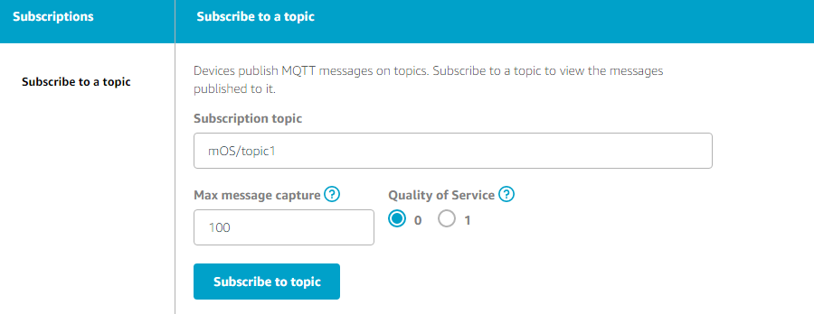
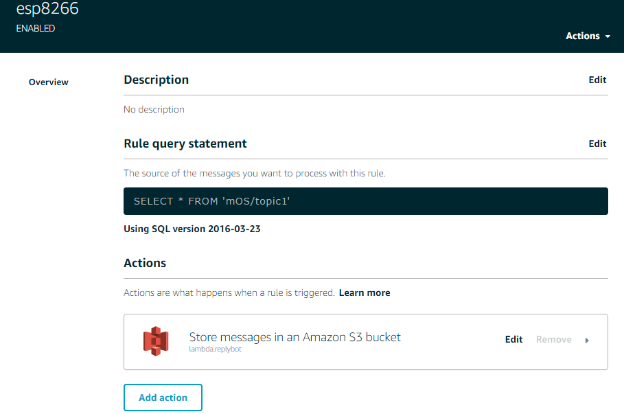

# IoT始めようとしてマイコンモジュール弄った
---
## 触ってみたもの
- Raspberry Pi 3
- ESP-WROOM-02


## 所感
- Raspberry Pi 3  
多少大きくて電源は食うものの、LinuxベースのOSが乗っかるのは凄いなーと言う感じ。  
ライブラリ周りは個人的にNodejsがとても力が入っているなあと言うか  
据え置き単品で解決するようなものであればラズパイでよいのではないかと。  
やっぱりデカイのと電池食うのと価格面でイマイチ。  
Zero Wがたくさん購入出来れば迷わず選択して良いぐらいのパフォーマンスがあった。  


- ESP-WROOM-02  
みんな大好きArduino IDEで開発できる安価なモジュール。  
チップ単体で買えばラズパイZeroより安くてWifiも付いてくるって凄いっすね。  
  - Arduino IDE(StandardFirmataWiFi)  
C,C+互換でコードを書くと動く。IDEとしてはunkoだけどこれしか無いならしゃーないよね。  
基本的なところはほぼライブラリになっていたので、Cと言っても言語使用に関わるほど深追いしなくて済む。  
プログラム書ける人なら誰でも触れそうな感じ。
  - [Mongoose OS](https://mongoose-os.com/)
Javascript（正しくはmJSと言うこれ専用のJSもどき）で書ける。  
凄いのはそこじゃなくて、セットアップウィザードに従って進めていけばAWS IoTとの通信に必要な設定がほぼ完了するところ。  
AWSでIAMにIoTフルアクセス付けたユーザ作ってアクセスキー発行。  
IoT側のSecurityにあるPoiciesに適当な名前でポリシー作成しておけばAWS側の受け入れ準備はOK。  
後はMongoose OSのウィザードに従えば証明書やら必要なものはぜーんぶ仕込んでくれます。
Code examplesにあるbutton_mqtt.jsを使うと、ピン0に接続したボタンでAWSサーバにメッセージが送信できます。  
メッセージ確認するならTestから↓のようなテストを作ればメッセージ受信が確認できる。  
  
Amazon Dashボタン作るならRulesにLambda呼び出しを設定して、Lambdaに発注メール送信なりAmazonの購入API叩くようにすれば良いです。  
  
※例は受信したメッセージをS3バケットに保存している。


## 困っていること
- ESP-WROOM-02を使ってMongooseOSからI2Cでデータ取得できない  
どはまりしていて、SI7021と言う製品の温度湿度センサーから値を取りたいのにさっぱりと言う。。  
```js
  let i2c = I2C.get_default(); 
  let r = I2C.readRegB(i2c, 0x40, 0xE5);
```
